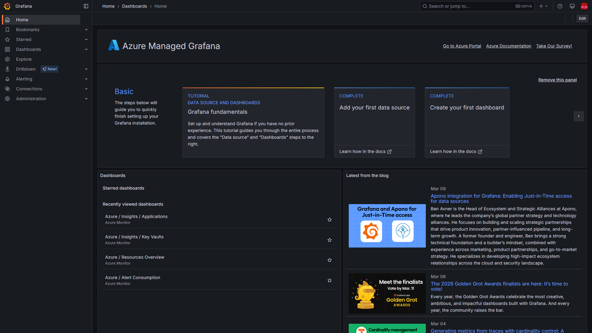
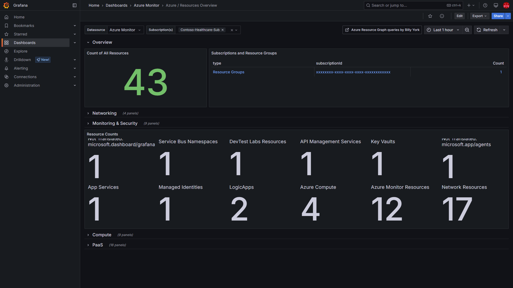
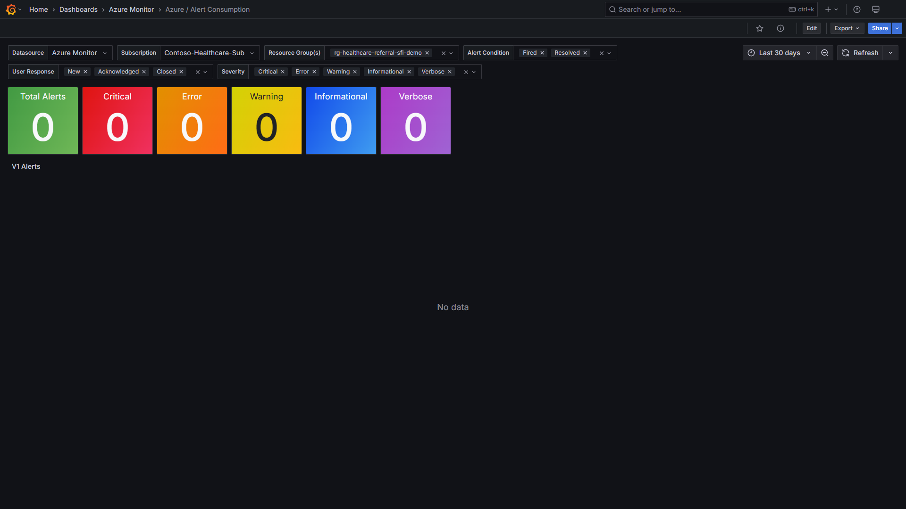
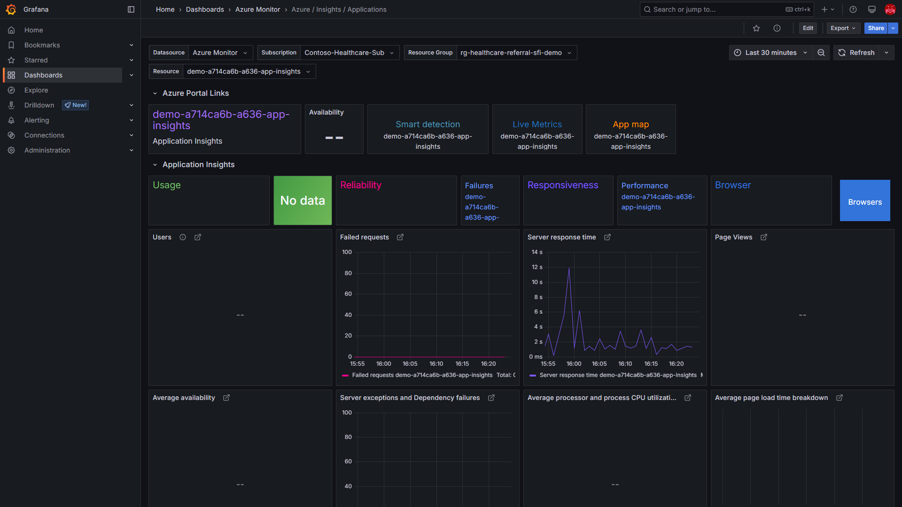
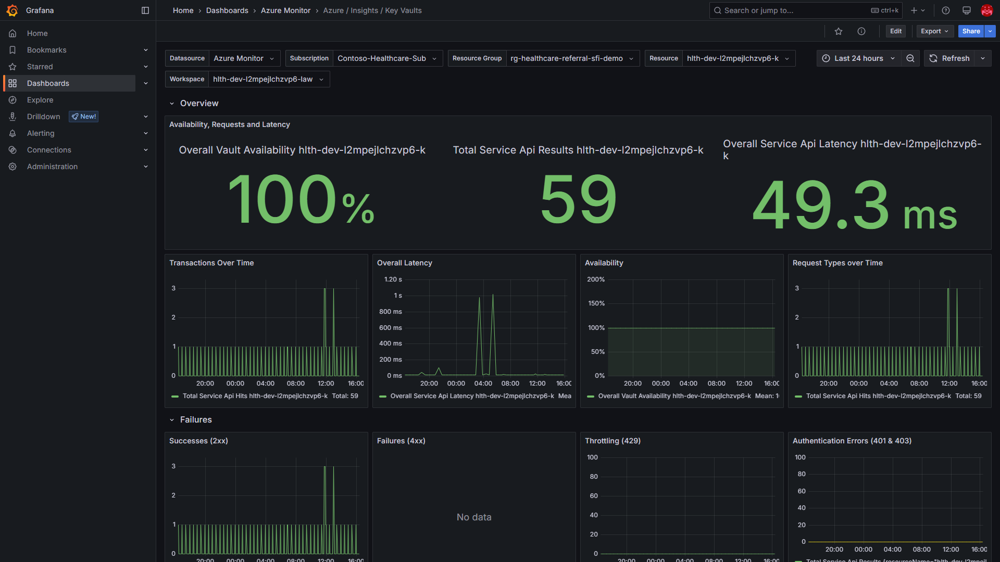
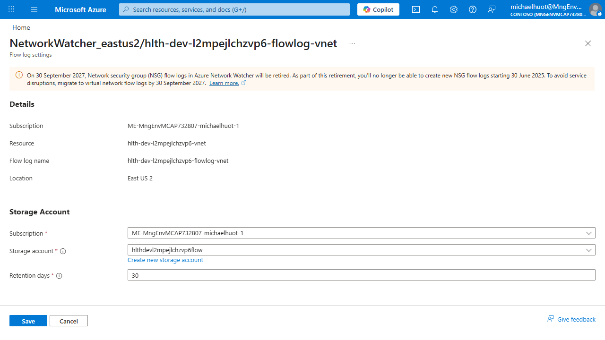
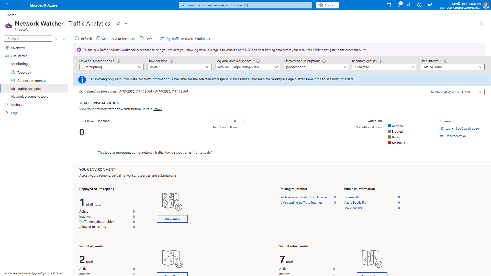
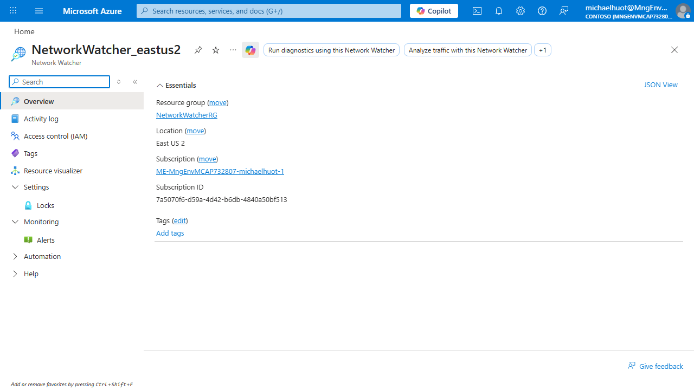
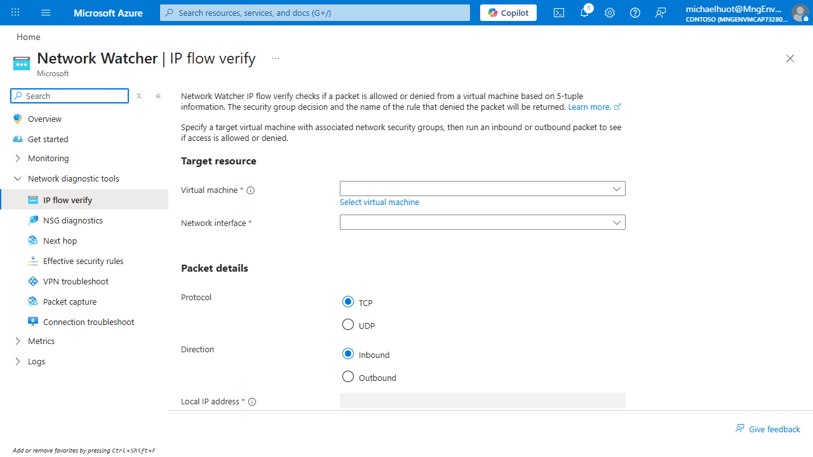
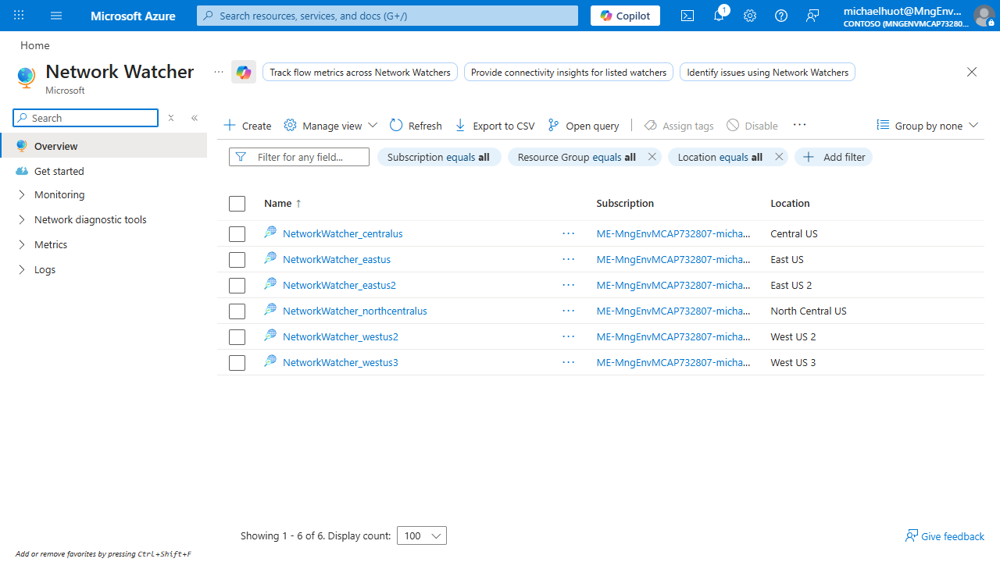

<!-- SPDX-License-Identifier: MIT -->

# Operations Guide — Healthcare Referral Routing Pipeline

Day-to-day operations reference for the Azure Logic Apps Healthcare Referral Routing demo: endpoints, testing, monitoring, networking, and troubleshooting.

---

## Table of Contents

- [Endpoints & Access](#endpoints--access)
- [Testing the Pipeline](#testing-the-pipeline)
- [Post-Deployment Checklist](#post-deployment-checklist)
- [Monitoring & Dashboards](#monitoring--dashboards)
- [Key KQL Queries](#key-kql-queries)
- [VNet & Network Security](#vnet--network-security)
- [VNet Flow Logs & Traffic Analytics](#vnet-flow-logs--traffic-analytics)
- [Troubleshooting](#troubleshooting)
- [Deployment Timing](#deployment-timing)
- [Resource Inventory](#resource-inventory)
- [Known Limitations](#known-limitations)

---

## Endpoints & Access

### APIM Referral Endpoint

```
POST https://<baseName>-apim.azure-api.net/referrals/submit
Header: Ocp-Apim-Subscription-Key: <key>
Content-Type: application/json
```

Rate limit: **10 requests per minute** (configurable in `modules/apim.bicep`).

### Retrieving the Endpoint and Subscription Key

These values are printed at the end of `./deploy.ps1` output. To retrieve them manually:

```powershell
$rg = "rg-healthcare-referral-demo"

# Get the APIM gateway URL
$apimName = az resource list -g $rg --resource-type Microsoft.ApiManagement/service --query "[0].name" -o tsv
$gateway = az apim show -n $apimName -g $rg --query "gatewayUrl" -o tsv
$endpoint = "$gateway/referrals/submit"

# Get the subscription key
$subId = az account show --query id -o tsv
$apimRid = "/subscriptions/$subId/resourceGroups/$rg/providers/Microsoft.ApiManagement/service/$apimName"
$subKey = az rest --method post `
    --url "$apimRid/subscriptions/referral-subscription/listSecrets?api-version=2022-08-01" `
    --query "primaryKey" -o tsv

Write-Host "Endpoint: $endpoint"
Write-Host "Key:      $subKey"
```

### Grafana Dashboard

```
https://<baseName>-grafana.eus2.grafana.azure.com
```

Requires **Grafana Admin** or **Grafana Viewer** RBAC role on the Grafana workspace resource. The deployer is assigned Grafana Admin automatically when `deploy.ps1` can resolve the signed-in user's object ID.

To grant access manually:

```powershell
$userId = az ad signed-in-user show --query id -o tsv
$grafanaId = az resource list -g $rg --resource-type Microsoft.Dashboard/grafana --query "[0].id" -o tsv
az role assignment create --assignee-object-id $userId --assignee-principal-type User `
    --role "Grafana Admin" --scope $grafanaId
```

> RBAC propagation takes a few minutes. Refresh Grafana (`Ctrl+F5`) or sign out/in if you see "No Role Assigned."

---

## Testing the Pipeline

Three test scripts are included — all require `-ApiEndpoint` and `-SubscriptionKey` parameters.

### Quick Smoke Test (`test-referral.ps1`)

Sends 3 referrals: urgent cardiology, normal physical therapy, and one intentionally invalid:

```powershell
./test-referral.ps1 -ApiEndpoint $endpoint -SubscriptionKey $subKey
```

**Expected results:**

| # | Referral | Priority | Expected Response | Destination Queue |
|---|----------|----------|-------------------|-------------------|
| 1 | Sarah Mitchell — Cardiology (I25.10) | `urgent` | `202 Accepted` | `urgent-referrals` |
| 2 | David Chen — Physical Therapy (M54.5) | `normal` | `202 Accepted` | `standard-referrals` |
| 3 | Missing required fields | — | `400 Bad Request` | Rejected at intake |

### Load Test (`test-referral-load.ps1`)

Burst traffic to generate chart-worthy Grafana data:

```powershell
# Default: 3 rounds × 15 patients + 2 invalid per round = 51 referrals
./test-referral-load.ps1 -ApiEndpoint $endpoint -SubscriptionKey $subKey

# More data, slower pacing
./test-referral-load.ps1 -ApiEndpoint $endpoint -SubscriptionKey $subKey -Rounds 5 -MaxDelayMs 8000
```

### Soak Test (`test-referral-soak.ps1`)

Continuous low-volume sender for Grafana warmup. **Start 30–60 minutes before a demo** so dashboards have data spread over time:

```powershell
# Default: 60 minutes, ~1 referral every 45s (~80 total)
./test-referral-soak.ps1 -ApiEndpoint $endpoint -SubscriptionKey $subKey

# Custom duration and pacing
./test-referral-soak.ps1 -ApiEndpoint $endpoint -SubscriptionKey $subKey `
    -DurationMinutes 90 -IntervalSeconds 30

# Press Ctrl+C to stop early — summary always prints
```

| Parameter | Default | Description |
|-----------|---------|-------------|
| `-DurationMinutes` | 60 | How long to run |
| `-IntervalSeconds` | 45 | Average time between requests (±40% jitter) |
| `-ErrorRate` | 0.08 | Fraction of requests that are intentionally invalid |

### Referral Payload Format

```json
{
  "patientId": "PT-2025-00142",
  "patientName": "Sarah Mitchell",
  "referralType": "Cardiology",
  "priority": "urgent",
  "diagnosis": {
    "code": "I25.10",
    "description": "Atherosclerotic heart disease of native coronary artery"
  },
  "referringProvider": "Dr. James Wilson, MD - Internal Medicine",
  "notes": "Patient presents with exertional dyspnea and chest tightness."
}
```

Valid `priority` values: `urgent`, `high`, `normal`, `low`.

### Routing Logic

| Priority | Destination Queue |
|----------|-------------------|
| `urgent` / `high` | `urgent-referrals` |
| `normal` / `low` | `standard-referrals` |

### Enrichment (added by Intake Logic App)

| Field | Value | Purpose |
|-------|-------|---------|
| `correlationId` | UUID (GUID) | End-to-end tracking across both Logic Apps |
| `receivedAt` | ISO 8601 timestamp | Audit trail |
| `status` | `"received"` | Workflow state tracking |

> **Tip:** Log Analytics has a 5–10 minute ingestion delay. Start the soak test early enough for data to appear in Grafana before your audience arrives.

---

## Post-Deployment Checklist

After `./deploy.ps1` completes, verify the following:

- [ ] **All resource types present** — `deploy.ps1` step [4/6] validates these automatically. Expect: Log Analytics, VNet, Service Bus (Premium), Key Vault, Logic App Standard, App Service Plan, Storage Account, APIM (StandardV2), Grafana, Private Endpoints, Private DNS Zones, Metric Alerts, Action Group.
- [ ] **Logic App workflows deployed** — Step [3b/6] deploys intake and router workflows via ZIP deploy. If this step failed, redeploy manually:
  ```powershell
  # Re-run ZIP deploy for workflow definitions
  Compress-Archive -Path workflows/* -DestinationPath workflows.zip -Force
  az webapp deployment source config-zip --resource-group $rg --name $logicAppName --src workflows.zip
  ```
- [ ] **APIM returns 202** — Run the smoke test:
  ```powershell
  ./test-referral.ps1 -ApiEndpoint $endpoint -SubscriptionKey $subKey
  ```
- [ ] **Service Bus queues receiving messages** — After the smoke test, check queue counts:
  ```powershell
  az servicebus queue list -g $rg --namespace-name $sbNamespace --query "[].{name:name, active:countDetails.activeMessageCount}" -o table
  ```
- [ ] **Grafana dashboard accessible** — Open the Grafana URL from `deploy.ps1` output. Verify the "Healthcare Referral Routing" dashboard is present (auto-imported during deployment).
- [ ] **Grafana RBAC assigned** — If you see "No Role Assigned," run the manual grant command from [Endpoints & Access](#grafana-dashboard).
- [ ] **Diagnostic settings active** — Verify all resources send to Log Analytics:
  ```powershell
  az monitor diagnostic-settings list --resource $logicAppId --query "[].name" -o tsv
  ```
- [ ] **Alerts configured** — Check metric alerts are enabled:
  ```powershell
  az monitor metrics alert list -g $rg --query "[].{name:name, enabled:enabled}" -o table
  ```

---

## Monitoring & Dashboards

### Grafana Home



Navigate to **Dashboards** and select **Healthcare Referral Routing** (UID: `healthcare-referral-routing`). The dashboard auto-refreshes every 30 seconds and defaults to a 1-hour time range.

### Healthcare Referral Dashboard — Overview


The top section contains four stat panels and two time series charts:

| Panel | Type | What It Shows |
|-------|------|---------------|
| **Total Referrals Received** | Stat | Count of completed intake workflow runs |
| **Urgent Referrals** | Stat | Messages sent to `urgent-referrals` queue (Azure Monitor metric) |
| **Standard Referrals** | Stat | Messages sent to `standard-referrals` queue (Azure Monitor metric) |
| **Validation Errors** | Stat | Count of failed intake runs (schema validation rejections) |
| **Intake Logic App Runs** | Stacked bar | Succeeded (green) vs Failed (red) runs over time, 5-min buckets |
| **Queue Message Flow** | Line chart | Incoming, outgoing, and dead-letter messages per queue over time |

### Healthcare Referral Dashboard — Workflow Runs


Both the Intake and Router Logic App run charts use the same stacked bar format — green for succeeded, red for failed. Gaps indicate no workflow activity during that time window.

### Healthcare Referral Dashboard — Queue Depths & APIM


The bottom section shows operational health indicators:

| Panel | Type | What It Shows |
|-------|------|---------------|
| **Queue Depths** | Bar gauge | Active message count per queue — your backlog indicator |
| **APIM Requests** | Line chart | Total, successful, and failed API Management requests |
| **Recent Referral Activity** | Table | Last 15 workflow runs with timestamp, workflow name, status, and correlation tracking ID |

### Azure Resources Overview



Grafana includes a built-in **Azure Monitor** data source. The resources overview dashboard provides a high-level view of resource health and metrics across the subscription.

### Alerting



Azure metric alerts (configured in `modules/alerts.bicep`) fire to an action group with email notifications. Alert rules include:

- **Dead-letter queue depth > 0** — Messages failing processing
- **Logic App failed runs > threshold** — Workflow errors
- **Key Vault unauthorized access** — Potential security events

### Application Insights



Logic App Standard publishes telemetry to Application Insights (backed by the same Log Analytics workspace). Use Application Insights for:

- Dependency tracking (Service Bus calls, Key Vault lookups)
- Failure analysis with end-to-end transaction views
- Performance profiling for individual referral processing

### Key Vault Metrics



Key Vault panels show API hit counts, latency percentiles, and availability. Useful for detecting throttling or unauthorized access patterns.

---

## Key KQL Queries

Run these in **Log Analytics workspace > Logs** or use them as Grafana panel data sources.

### Total Referrals Received (Intake Runs)

```kql
AzureDiagnostics
| where ResourceProvider == "MICROSOFT.LOGIC"
| where resource_workflowName_s endswith "-intake"
| where OperationName == "Microsoft.Logic/workflows/workflowRunCompleted"
| summarize Total=count() by bin(TimeGenerated, 1h)
| order by TimeGenerated desc
```

### Validation Errors (Failed Intake Runs)

```kql
AzureDiagnostics
| where ResourceProvider == "MICROSOFT.LOGIC"
| where resource_workflowName_s endswith "-intake"
| where OperationName == "Microsoft.Logic/workflows/workflowRunCompleted"
| where status_s == "Failed"
| summarize ValidationErrors=count() by bin(TimeGenerated, 5m)
| order by TimeGenerated desc
```

### Intake Logic App Runs (Succeeded vs Failed)

```kql
AzureDiagnostics
| where ResourceProvider == "MICROSOFT.LOGIC"
| where resource_workflowName_s endswith "-intake"
| where OperationName == "Microsoft.Logic/workflows/workflowRunCompleted"
| summarize Succeeded=countif(status_s == "Succeeded"),
            Failed=countif(status_s == "Failed")
    by bin(TimeGenerated, 5m)
| order by TimeGenerated asc
```

### Router Logic App Runs

```kql
AzureDiagnostics
| where ResourceProvider == "MICROSOFT.LOGIC"
| where resource_workflowName_s endswith "-router"
| where OperationName == "Microsoft.Logic/workflows/workflowRunCompleted"
| summarize Succeeded=countif(status_s == "Succeeded"),
            Failed=countif(status_s == "Failed")
    by bin(TimeGenerated, 5m)
| order by TimeGenerated asc
```

### Recent Referral Activity (Last 15 Runs)

```kql
AzureDiagnostics
| where ResourceProvider == "MICROSOFT.LOGIC"
| where Category == "WorkflowRuntime"
| where OperationName == "Microsoft.Logic/workflows/workflowRunCompleted"
| project Time=TimeGenerated,
          Workflow=resource_workflowName_s,
          Status=status_s,
          TrackingId=correlation_clientTrackingId_s
| order by Time desc
| take 15
```

### Service Bus Queue Metrics

```kql
AzureMetrics
| where ResourceProvider == "MICROSOFT.SERVICEBUS"
| where MetricName in ("IncomingMessages", "OutgoingMessages", "DeadletteredMessages")
| summarize Total=sum(Total) by MetricName, Resource
| order by Resource asc
```

### APIM Gateway Logs

```kql
AzureDiagnostics
| where ResourceProvider == "MICROSOFT.APIMANAGEMENT"
| where Category == "GatewayLogs"
| project TimeGenerated, apiId_s, operationId_s,
          responseCode_d, callerIpAddress_s, durationMs_d
| order by TimeGenerated desc
| take 20
```

### Key Vault Unauthorized Access

```kql
AzureDiagnostics
| where ResourceProvider == "MICROSOFT.KEYVAULT"
| where ResultSignature == "Unauthorized"
| project TimeGenerated, OperationName, CallerIPAddress,
          ResultSignature, Resource
| order by TimeGenerated desc
```

### Network Traffic — Denied Flows (requires Traffic Analytics)

```kql
AzureNetworkAnalytics_CL
| where TimeGenerated > ago(1h)
| where FlowStatus_s == "D"
| summarize Count=count() by SrcIP_s, DestIP_s, DestPort_d, NSGRule_s
| order by Count desc
```

---

## VNet & Network Security

### VNet Layout

| Subnet | CIDR | NSG | Key Resources |
|--------|------|-----|---------------|
| `snet-apim` | `10.0.1.0/24` | `nsg-apim` | API Management (StandardV2) |
| `snet-private-endpoints` | `10.0.2.0/24` | `nsg-pe` | Service Bus PE, Key Vault PE, Grafana PE, Logic App PE |
| `snet-logic-apps` | `10.0.3.0/24` | `nsg-pe` | Logic App Standard (VNet-integrated, delegated to `Microsoft.Web/serverFarms`) |
| `snet-jumpbox` | `10.0.4.0/24` | `nsg-pe` | Jumpbox VM (Bastion access, deallocated by default) |

VNet address space: `10.0.0.0/16` (configurable via `vnetAddressPrefix` parameter).

### NSG Rules

**`nsg-apim`** (APIM subnet):

| Rule | Priority | Direction | Access | Source | Dest Port |
|------|----------|-----------|--------|--------|-----------|
| Allow-APIM-Management | 100 | Inbound | Allow | `ApiManagement` | 3443 |
| Allow-HTTPS-Inbound | 110 | Inbound | Allow | `Internet` | 443 |
| Allow-LoadBalancer | 120 | Inbound | Allow | `AzureLoadBalancer` | 6390 |
| Allow-Storage-Outbound | 100 | Outbound | Allow | `VirtualNetwork` | 443 |
| Allow-SQL-Outbound | 110 | Outbound | Allow | `VirtualNetwork` | 1433 |
| Allow-AzureAD-Outbound | 120 | Outbound | Allow | `VirtualNetwork` | 443 |

**`nsg-pe`** (PE, Logic Apps, Jumpbox subnets):

| Rule | Priority | Direction | Access | Source | Dest Port |
|------|----------|-----------|--------|--------|-----------|
| Allow-VNet-Inbound | 100 | Inbound | Allow | `VirtualNetwork` | `*` |
| Deny-All-Inbound | 4096 | Inbound | Deny | `*` | `*` |

### Private Endpoints

| Private Endpoint | Target Service | Private DNS Zone |
|-----------------|----------------|------------------|
| `<baseName>-pe-sb` | Service Bus Namespace | `privatelink.servicebus.windows.net` |
| `<baseName>-pe-kv` | Key Vault | `privatelink.vaultcore.azure.net` |
| `<baseName>-pe-grafana` | Managed Grafana | `privatelink.grafana.azure.com` |
| `<baseName>-pe-logicapp` | Logic App Standard | `privatelink.azurewebsites.net` |

All private endpoints resolve via private DNS zones linked to the VNet. Verify DNS resolution from the jumpbox:

```powershell
nslookup <baseName>-sbns.servicebus.windows.net
# Should resolve to 10.0.2.x (private IP), NOT a public IP
```

> For deep-dive network diagnostics including IP Flow Verify, Connection Troubleshoot, flow log queries, and NSG effective rules, see the [Network Troubleshooting Guide](network-troubleshooting.md).

---

## VNet Flow Logs & Traffic Analytics

VNet flow logs provide network traffic visibility across all subnets. They replace the deprecated NSG flow logs (blocked for new creation since June 2025).

### Configuration

| Setting | Value |
|---------|-------|
| Flow log name | `<baseName>-flowlog-vnet` |
| Target | VNet (`<baseName>-vnet`) — covers all 4 subnets in one config |
| Storage account | `<baseName>flow` (dedicated, Standard_LRS, shared key access disabled) |
| Log format | JSON v2 |
| Retention | 30 days |
| Traffic Analytics | Enabled (10-minute processing interval) |
| Log Analytics workspace | `<baseName>-law` |
| Authentication | User-assigned managed identity with Storage Blob Data Contributor |



### Managed Identity Setup

Flow logs authenticate to the storage account using a **user-assigned managed identity** (`<baseName>-flowlog-identity`), not shared keys. This is an SFI requirement — `allowSharedKeyAccess` is set to `false` on the flow log storage account.

The Bicep module (`modules/flow-logs.bicep`) creates:

1. A dedicated storage account with `allowSharedKeyAccess: false`
2. A user-assigned managed identity
3. A `Storage Blob Data Contributor` role assignment scoping the identity to the storage account
4. The VNet flow log resource (deployed into `NetworkWatcherRG`)

### Viewing Traffic Analytics

1. Navigate to **Network Watcher** in the Azure portal
2. Under **Monitoring**, select **Traffic Analytics**
3. **Set the FlowLog Type dropdown to "VNET"** (not NSG — this is a common mistake)
4. Select your Log Analytics workspace
5. Data appears after **20–30 minutes** from when flow logs were enabled



### Querying Flow Data in Log Analytics

```kql
-- All intra-VNet traffic (APIM → Logic App path)
AzureNetworkAnalytics_CL
| where FlowType_s == "IntraVNet"
| where SrcIP_s startswith "10.0.1"     // APIM subnet
| where DestIP_s startswith "10.0.2"    // PE subnet
| where DestPort_d == 443
| project TimeGenerated, SrcIP_s, DestIP_s, DestPort_d,
          FlowStatus_s, NSGRule_s, FlowDirection_s
| order by TimeGenerated desc
| take 50
```

### CLI Commands for Flow Log Diagnostics

```powershell
# Show flow log configuration
az network watcher flow-log show -l eastus2 -n "<baseName>-flowlog-vnet" -o table

# List NSG rules for APIM subnet
az network nsg rule list --nsg-name "<baseName>-nsg-apim" -g $rg `
    --query "[].{Name:name, Priority:priority, Direction:direction, Access:access, SrcAddr:sourceAddressPrefix, DstPort:destinationPortRange}" -o table

# List NSG rules for PE subnet
az network nsg rule list --nsg-name "<baseName>-nsg-pe" -g $rg `
    --query "[].{Name:name, Priority:priority, Direction:direction, Access:access, SrcAddr:sourceAddressPrefix, DstPort:destinationPortRange}" -o table

# List private endpoints
az network private-endpoint list -g $rg `
    --query "[].{Name:name, GroupId:privateLinkServiceConnections[0].groupIds[0]}" -o table

# List private DNS zones and verify records
az network private-dns zone list -g $rg -o table

# Query network topology via Log Analytics
az monitor log-analytics query -w "<workspace-guid>" `
    --analytics-query "NTATopologyDetails | project TimeGenerated, Name, AzureResourceType, Region, AddressPrefixes, Nsg | order by AzureResourceType | take 20" `
    --timespan PT24H -o table
```

> For full sample CLI output and expected results, see [`flowlogs-cli-output.txt`](flowlogs-cli-output.txt).

### Network Watcher Tools



| Tool | When to Use |
|------|-------------|
| **Traffic Analytics** | Ongoing monitoring, capacity planning, flow pattern analysis |
| **IP Flow Verify** | Quick test: is a specific packet allowed or denied by NSG rules? |
| **Connection Troubleshoot** | End-to-end connectivity test (e.g., APIM → Logic App) |
| **NSG Diagnostics** | Detailed rule evaluation for a blocked flow |
| **Effective Security Rules** | View merged NSG rules on a specific NIC |





> For step-by-step diagnostic procedures using these tools, see the [Network Troubleshooting Guide](network-troubleshooting.md).

---

## Troubleshooting

### Pipeline Returns 500 After Deployment

**Symptom:** APIM returns HTTP 500 when calling the Logic App endpoint.

**Cause:** Logic App Standard workflows may not be fully initialized after ZIP deployment.

**Fix:**
1. In the Azure Portal, navigate to the Logic App Standard resource
2. Go to **Workflows** and verify both `intake` and `router` appear
3. If workflows are missing, redeploy:
   ```powershell
   Compress-Archive -Path workflows/* -DestinationPath workflows.zip -Force
   az webapp deployment source config-zip --resource-group $rg --name $logicAppName --src workflows.zip
   ```
4. Restart the Logic App:
   ```powershell
   az webapp restart --resource-group $rg --name $logicAppName
   ```

### V1 vs V2 API Connections (Consumption Logic Apps)

**Symptom:** Consumption Logic Apps fail to connect to Service Bus.

**Cause:** Consumption Logic Apps only support **V1 API connections** (shared connector infrastructure). The V1 connector uses the public endpoint, not private endpoints.

**Fix:** If using Consumption Logic Apps (not Standard), ensure Service Bus `publicNetworkAccess` is set to `Enabled`. The current `modules/service-bus.bicep` already sets this:

```bicep
properties: {
  publicNetworkAccess: 'Enabled'   // Required for Consumption Logic Apps
  minimumTlsVersion: '1.2'
}
```

Logic App Standard with VNet integration connects via the private endpoint and does not require public access.

### Service Bus Connectivity Issues

**Symptom:** Logic App workflows fail with `NotFound` or `Unauthorized` on Send/Receive queue actions.

**Diagnosis:**
1. Check managed identity RBAC:
   ```powershell
   az role assignment list --scope $(az servicebus namespace show -n "<baseName>-sbns" -g $rg --query id -o tsv) -o table
   ```
   Expect: `Azure Service Bus Data Sender` and `Azure Service Bus Data Receiver` for the Logic App identity.

2. Check private endpoint status:
   ```powershell
   az network private-endpoint show --name "<baseName>-pe-sb" -g $rg `
       --query "privateLinkServiceConnections[0].privateLinkServiceConnectionState.status" -o tsv
   ```
   Should return `Approved`.

3. Verify DNS resolution from within the VNet (via jumpbox):
   ```powershell
   nslookup <baseName>-sbns.servicebus.windows.net
   ```

> See also: [Network Troubleshooting Guide — Logic App Cannot Reach Service Bus](network-troubleshooting.md#2-logic-app-cannot-reach-service-bus-send_to_queue-fails).

### APIM Soft-Delete Conflicts

**Symptom:** Deployment fails with `ServiceAlreadyExists` or `ApiManagementServiceAlreadyExists`.

**Cause:** APIM has a 48-hour soft-delete retention. If you delete and redeploy within that window, the old APIM instance conflicts.

**Fix:**
```powershell
# List soft-deleted APIM instances
az rest --method GET `
    --url "/subscriptions/$(az account show --query id -o tsv)/providers/Microsoft.ApiManagement/deletedservices?api-version=2022-08-01" `
    --query "value[].{name:name, location:location, deletionDate:properties.deletionDate}" -o table

# Purge a specific soft-deleted instance
az rest --method DELETE `
    --url "/subscriptions/$(az account show --query id -o tsv)/providers/Microsoft.ApiManagement/locations/eastus2/deletedservices/<apimName>?api-version=2022-08-01"
```

Then re-run `./deploy.ps1`.

### Flow Logs Not Writing to Storage

**Symptom:** Flow log storage account has no blob containers or data.

**Cause:** Managed identity may not have the `Storage Blob Data Contributor` role, or `allowSharedKeyAccess: false` is set without a managed identity.

**Fix:**
1. Verify role assignment:
   ```powershell
   $storageId = az storage account show -n "<baseName>flow" -g $rg --query id -o tsv
   az role assignment list --scope $storageId --query "[?roleDefinitionName=='Storage Blob Data Contributor']" -o table
   ```
   The flow log managed identity (`<baseName>-flowlog-identity`) must have this role.

2. If missing, the `modules/flow-logs.bicep` module creates this automatically. Redeploy:
   ```powershell
   az deployment group create -g $rg --template-file main.bicep --parameters parameters/dev.bicepparam
   ```

3. Flow logs take **10–15 minutes** to begin writing after creation. Check again after waiting.

### Traffic Analytics Shows "No Data"

**Symptom:** Traffic Analytics page is empty or shows "no data available."

**Causes and fixes:**
1. **Not enough time** — Traffic Analytics needs **20–30 minutes** of data collection after flow logs are enabled. Wait and refresh.
2. **Wrong FlowLog Type** — In the Traffic Analytics dropdown, select **VNET** (not **NSG**). VNet flow logs use a different type than the deprecated NSG flow logs.
3. **Wrong workspace** — Ensure the workspace selector matches the Log Analytics workspace your flow logs target.
4. **No traffic** — Generate traffic by running the test scripts.

### APIM Returns 401 Unauthorized

**Symptom:** Test script gets `401`.

**Fix:** The subscription key may be incorrect. Retrieve the current key:
```powershell
$subId = az account show --query id -o tsv
$apimName = az resource list -g $rg --resource-type Microsoft.ApiManagement/service --query "[0].name" -o tsv
az rest --method post `
    --url "/subscriptions/$subId/resourceGroups/$rg/providers/Microsoft.ApiManagement/service/$apimName/subscriptions/referral-subscription/listSecrets?api-version=2022-08-01" `
    --query "primaryKey" -o tsv
```

### APIM Returns 429 Too Many Requests

**Symptom:** Rate limited after rapid testing.

**Fix:** The APIM rate limit is 10 requests per minute. Wait 60 seconds and retry, or adjust the rate limit in `modules/apim.bicep`.

---

## Deployment Timing

Approximate times per component during `./deploy.ps1`:

| Component | Approximate Time | Notes |
|-----------|-----------------|-------|
| Resource Group creation | ~5s | |
| Log Analytics workspace | ~30s | |
| Virtual Network + NSGs | ~30s | |
| Service Bus Premium | ~2–3 min | Premium tier takes longer than Standard |
| Key Vault | ~30s | |
| Private Endpoints + DNS | ~1–2 min | 4 private endpoints + DNS zone links |
| Logic App Standard + App Service Plan | ~1–2 min | Includes storage account |
| Role Assignments (RBAC) | ~30s | |
| API Management (StandardV2) | ~3–5 min | Longest single component |
| Managed Grafana | ~2–3 min | |
| Diagnostic Settings | ~30s | |
| Metric Alerts | ~30s | |
| VNet Flow Logs | ~1 min | Deployed into NetworkWatcherRG |
| Bastion + Jumpbox VM | ~3–5 min | Optional (`deployBastion` parameter) |
| Workflow ZIP Deploy | ~30s | Step [3b/6] |
| Grafana Dashboard Import | ~15s | Step [6/6] |
| **Total** | **~5–6 min** | Without Bastion; ~8–10 min with Bastion |

> APIM soft-delete conflicts can add time if purging is needed. See [Troubleshooting](#apim-soft-delete-conflicts).

---

## Resource Inventory

All resources deploy to `rg-healthcare-referral-demo` (configurable via `-ResourceGroupName`).

| Resource | Type | Naming Pattern |
|----------|------|----------------|
| Log Analytics workspace | `Microsoft.OperationalInsights/workspaces` | `<baseName>-law` |
| VNet | `Microsoft.Network/virtualNetworks` | `<baseName>-vnet` |
| NSG (APIM) | `Microsoft.Network/networkSecurityGroups` | `<baseName>-nsg-apim` |
| NSG (PE/LA/Jumpbox) | `Microsoft.Network/networkSecurityGroups` | `<baseName>-nsg-pe` |
| Service Bus Namespace | `Microsoft.ServiceBus/namespaces` | `<baseName>-sbns` |
| Queue: Incoming | `Microsoft.ServiceBus/namespaces/queues` | `incoming-referrals` |
| Queue: Urgent | `Microsoft.ServiceBus/namespaces/queues` | `urgent-referrals` |
| Queue: Standard | `Microsoft.ServiceBus/namespaces/queues` | `standard-referrals` |
| Key Vault | `Microsoft.KeyVault/vaults` | `<baseName>-kv` |
| Private Endpoint (SB) | `Microsoft.Network/privateEndpoints` | `<baseName>-pe-sb` |
| Private Endpoint (KV) | `Microsoft.Network/privateEndpoints` | `<baseName>-pe-kv` |
| Private Endpoint (Grafana) | `Microsoft.Network/privateEndpoints` | `<baseName>-pe-grafana` |
| Private Endpoint (Logic App) | `Microsoft.Network/privateEndpoints` | `<baseName>-pe-logicapp` |
| Private DNS Zone (SB) | `Microsoft.Network/privateDnsZones` | `privatelink.servicebus.windows.net` |
| Private DNS Zone (KV) | `Microsoft.Network/privateDnsZones` | `privatelink.vaultcore.azure.net` |
| Private DNS Zone (Grafana) | `Microsoft.Network/privateDnsZones` | `privatelink.grafana.azure.com` |
| Logic App Standard | `Microsoft.Web/sites` | `<baseName>-logicapp` |
| App Service Plan | `Microsoft.Web/serverfarms` | `<baseName>-asp` |
| Storage Account (Logic App) | `Microsoft.Storage/storageAccounts` | `<baseName>st` |
| API Management | `Microsoft.ApiManagement/service` | `<baseName>-apim` |
| Managed Grafana | `Microsoft.Dashboard/grafana` | `<baseName>-grafana` |
| Flow Log Storage Account | `Microsoft.Storage/storageAccounts` | `<baseName>flow` |
| Flow Log Managed Identity | `Microsoft.ManagedIdentity/userAssignedIdentities` | `<baseName>-flowlog-identity` |
| VNet Flow Log | `Microsoft.Network/networkWatchers/flowLogs` | `<baseName>-flowlog-vnet` |
| Action Group | `Microsoft.Insights/actionGroups` | `<baseName>-action-group` |
| Metric Alerts | `Microsoft.Insights/metricAlerts` | Various |
| Bastion Host (optional) | `Microsoft.Network/bastionHosts` | `<baseName>-bastion` |
| Jumpbox VM (optional) | `Microsoft.Compute/virtualMachines` | `<baseName>-jbox` |

> `<baseName>` is generated as `hlth-<environment>-<uniqueString>` (e.g., `hlth-dev-l2mpejlchzvp6`).

### Service Bus Queue Configuration

All three queues share identical settings:

| Setting | Value |
|---------|-------|
| Max delivery count | 10 |
| Lock duration | 1 minute |
| Default message TTL | 14 days |
| Dead-lettering on expiration | Enabled |

### RBAC Role Assignments

| Identity | Role | Scope |
|----------|------|-------|
| Logic App Standard | Azure Service Bus Data Sender | Service Bus Namespace |
| Logic App Standard | Azure Service Bus Data Receiver | Service Bus Namespace |
| Logic App Standard | Key Vault Secrets User | Key Vault |
| Deploying user (optional) | Grafana Admin | Managed Grafana |
| Flow Log Identity | Storage Blob Data Contributor | Flow Log Storage Account |

---

## Known Limitations

| Area | Current State | Target State | Notes |
|------|--------------|--------------|-------|
| **Logic App tier** | Standard (VNet-integrated) | Standard | Originally Consumption; migrated to Standard for VNet integration and private endpoint support |
| **APIM VNet injection** | Not VNet-injected (subnet allocated but not used for injection) | VNet-injected (internal mode) | StandardV2 supports VNet injection; planned for future iteration |
| **Grafana access** | Private endpoint deployed; public access still enabled for demo convenience | Private-only via APIM reverse proxy | Grafana PE is provisioned; full lockdown planned |
| **Service Bus public access** | Enabled (`publicNetworkAccess: Enabled`) | Disabled | Left enabled for compatibility; Logic App Standard uses PE path |
| **Bastion/Jumpbox** | Deployed but VM deallocated | On-demand start via automation | Deallocated to save cost; start via Portal or `az vm start` when needed |
| **APIM JWT validation** | Optional (disabled by default) | Enabled with Entra ID | Pass `apimTenantId` parameter to enable |
| **Alert action group** | Email only | Email + Teams webhook + PagerDuty | Extend `modules/alerts.bicep` for additional notification channels |
| **Grafana dashboard** | Auto-imported; single dashboard | Multiple dashboards (ops, security, compliance) | Add dashboards to `docs/` and import via `az grafana dashboard import` |
| **CI/CD** | GitHub Actions (validate + manual deploy) | Full GitOps with environment approval gates | `.github/workflows/deploy.yml` has environment approval; expand for staging/prod |

### Cost Considerations

| Resource | Tier | Monthly Cost |
|----------|------|-------------|
| API Management | StandardV2 | ~$170 |
| Service Bus | Premium (1 MU) | ~$700 |
| Logic App Standard | WS1 | ~$150 |
| Managed Grafana | Standard | ~$36 |
| VNet + Private Endpoints | — | ~$22 |
| Log Analytics | Pay-per-GB | ~$2.76/GB |
| Bastion (if running) | Basic | ~$140 |
| **Estimated total** | | **~$1,100/month** |

> **Tear down after demo** to avoid ongoing charges: `az group delete --name rg-healthcare-referral-demo --yes --no-wait`
